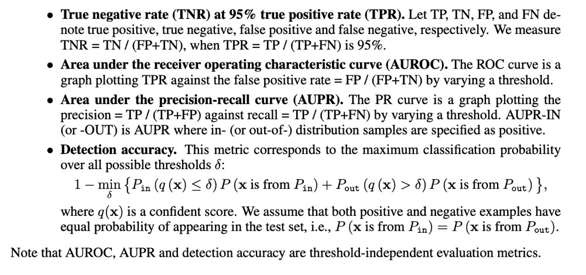

## Notes
[The multivariate gaussian distribution](https://cs229.stanford.edu/section/gaussians.pdf)
## Papers
1. labels
    > \# = unread
    >
    > \* = important
### Survey
1. [Generalized Out-of-Distribution Detection:A Survey](https://arxiv.org/pdf/2110.11334.pdf)

2. [Out-of-Distribution Detection in Deep Learning: A Survey](https://www.researchgate.net/publication/)

3. [A Unified Survey on Anomaly, Novelty, Open-Set, and Outof-Distribution Detection: Solutions and Future Challenges](https://openreview.net/pdf?id=aRtjVZvbpK)

4. [A Comprehensive Survey on Test-Time Adaptation under Distribution Shifts](https://arxiv.org/abs/2303.15361)
* 

### OOD
1. (nips2018) [A Simple Unified Framework for Detecting Out-of-Distribution Samples and Adversarial Attacks](https://arxiv.org/abs/1807.03888)
    > 1.Softmax classifier produce overconfidence for abnormal samples that are far away from the decision boundary
    >
    > 2."Our high-level idea is to measure the probability density of test sample on feature spaces of DNNs utilizing the concept of a “generative” (distance-based) classifier. Specifically, we assume that pre-trained features can be fitted well by a class-conditional Gaussian distribution since its posterior distribution can be shown to be equivalent to the softmax classifier under Gaussian discriminant analysis" 
    >
    > 3.Performance metrics 
2. #(ICML2022)[POEM: Out-of-Distribution Detection with Posterior Sampling](https://proceedings.mlr.press/v162/ming22a/ming22a.pdf)
3. [Out-of-Distribution Detection with Hilbert-Schmidt Independence Optimization](https://arxiv.org/abs/2209.12807)
    > statistical independent

4. (ICLR2021)[Multiscale Score Matching for Out-of-Distribution Detection](https://arxiv.org/pdf/2010.13132.pdf)
    > Nonparametric models are flexible models that don't make strong assumptions about the form of the underlying distribution.
    >
    > datasets did tend to be separable in the L-dimensional space of score norms

5. (ICML2022)[Partial and Asymmetric Contrastive Learning for
Out-of-Distribution Detection in Long-Tailed Recognition](https://arxiv.org/pdf/2207.01160.pdf)
    
6. (ICLR2017)[Training deep neural-networks using a noise adaptation layer](https://openreview.net/pdf?id=H12GRgcxg)
    > build hidden variable; EM algorithm
7. *(AAAI 2022) [Provable Guarantees for Understanding Out-of-distribution Detection](https://arxiv.org/abs/2112.00787)
8. *(ICLR2018)[Deep Autoencoding Gaussian Mixture Model for Unsupervised Anomaly Detection](https://openreview.net/pdf?id=BJJLHbb0-)
    > #related work: [Improving Reconstruction Autoencoder Out-of-distribution Detection with Mahalanobis Distance](https://arxiv.org/abs/1812.02765)
9. (AAAI2020)[Self-Supervised Learning for Generalizable Out-of-Distribution Detection](https://www.researchgate.net/publication/342536854_Self-Supervised_Learning_for_Generalizable_Out-of-Distribution_Detection)
    > self-supervised; pseudolabel
10. (ICLR2019)[Deep Anomaly Detection with Outlier Exposure](https://arxiv.org/pdf/1812.04606.pdf)
    > OOD data exposure; make the prediction of the OOD inputs uniform 
    >
    > using the real-world dataset as OE is better than synthetic anomalies
    >
    > important factors: size, realism, diversity (classes)
    >
    > OE and Test data need not be close for training

11. (ICLR2023)[DOE]
    > extend the auxiliary OOD set via perturbing model parameters

#### Partial-label learning
1. (Nips2022) SoLar: Sinkhorn Label Refinery for Imbalanced Partial-Label Learning
    > with the long-tailed distribution, existing methods exhibit bias toward head class while degenerating in the tail class
    > the paper uses the mass constraint in OT to align the real distribution (e.g. imbalanced long-tailed distribution) to refine the psudo-label 

#### Long-tailed OOD detection
* 

#### OT
* [WOOD: Wasserstein-based Out-of-Distribution Detection](https://arxiv.org/pdf/2112.06384.pdf)
    > leverage Wasserstein distance in measuring the dissimilarity between softmax outputs from classifier (actually discrete distributions)
* (CVPR2023)[Uncertainty-Aware Optimal Transport for Semantically Coherent Out-of-Distribution Detection](https://arxiv.org/pdf/2303.10449.pdf)
#### Adapting Wasserstein distance into the loss function
12. #*(ICML2017)[Wasserstein generative adversarial networks](https://arxiv.org/abs/1701.07875)
13. #(NIPS2015)[Learning with a Wasserstein Loss](https://arxiv.org/abs/1506.05439)

#### Incremental learning
* (CVPR2017)[iCaRL: Incremental Classifier and Representation Learning](https://arxiv.org/abs/1611.07725)
* (ACL2022)[On Continual Model Refinement in Out-of-Distribution Data Streams](https://aclanthology.org/2022.acl-long.223.pdf)
* (CVPR2022 ws)[Out-Of-Distribution Detection In Unsupervised Continual Learning](https://arxiv.org/pdf/2204.05462.pdf)
* #(ICML2021)[GP-Tree: A Gaussian Process Classifier for Few-Shot Incremental Learning](https://arxiv.org/abs/2102.07868)
* #(cvpr2022 wr)[Continual Learning Based on OOD Detection and Task Masking](https://arxiv.org/pdf/2203.09450.pdf)

#### test-time adaption (utilizing test OOD data)
* (arxiv)[AUTO: Adaptive Outlier Optimization for Online Test-Time OOD Detection](https://arxiv.org/pdf/2303.12267.pdf)
https://arxiv.org/pdf/2207.08210.pdf
* (arxiv)[A simple test-time method for Out-of-Distribution detection](https://arxiv.org/pdf/2207.08210.pdf)
* (ICML2022)[Training OOD Detectors in their Natural Habitats](https://arxiv.org/pdf/2202.03299.pdf)

#### uncertainty estimate
* #(aistats2023)[Uncertainty Estimates of Predictions via a General Bias-Variance Decomposition](https://proceedings.mlr.press/v206/gruber23a/gruber23a.pdf)
* #(UAI2023)[In- or Out-of-Distribution Detection via Dual Divergence Estimation](https://openreview.net/pdf?id=9Lo52ll_izs)
